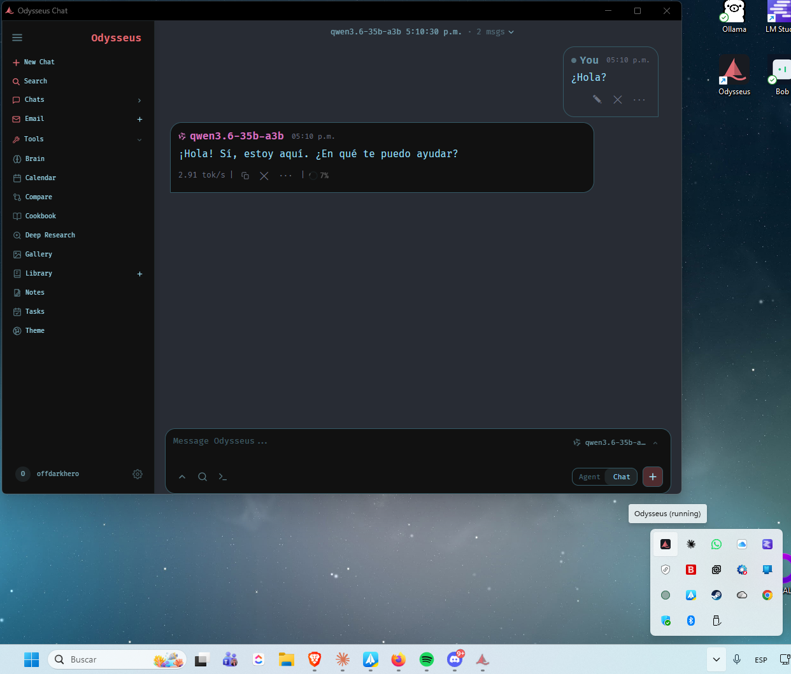

# Odysseus on Windows — Desktop install (icon + standalone window)

This guide describes a **convenience layer for native Windows** built on top of
Odysseus: a one-command installer that leaves the app ready with **memory and RAG
working**, **multilingual embeddings**, **agent web browsing**, and a **desktop
icon** that opens Odysseus in its **own window** (PWA app mode), with no black
console and waiting until the server is ready before opening.



*Odysseus running in its own window (PWA app mode) via the desktop icon, with the
"Odysseus (running)" system tray icon and a local model served by LM Studio.*

> Note: this does **not** modify Odysseus' internal behavior. These are scripts
> and files *added around* the app (installer, launcher, icon). The original
> Odysseus code is untouched, so you can keep updating with `git pull` normally.

---

## What it improves over the base install

The default native install (`launch-windows.ps1`) starts the server in a console
and opens the browser. This layer adds, on top of that:

| Improvement | What it solves |
|---|---|
| **Automatic local ChromaDB server** | Without Docker, vector memory and RAG stayed `DEGRADED`. Now they start on their own. |
| **Multilingual embedding model** | The default model (`all-MiniLM-L6-v2`) is weak on non-English text. Uses `paraphrase-multilingual-mpnet-base-v2`. |
| **Preinstalled Browser MCP** | Enables the agent's web browsing / screenshots (Playwright). |
| **Desktop icon (the boat)** | Shortcut with the Odysseus logo, generated locally. |
| **Launcher with splash** | Loading screen with live status, **no black console**. |
| **Readiness wait** | The browser opens **only once the server responds** (no more "can't connect"). |
| **Standalone window (app mode)** | Odysseus opens in its own window, no tabs or address bar. |
| **System tray icon** | Menu to *Open* or *Stop* Odysseus (ChromaDB included). |

---

## Where each piece comes from (credits)

- **Odysseus** — the base app. Original project: <https://github.com/pewdiepie-archdaemon/odysseus> (MIT license).
- **ChromaDB** — the vector database Odysseus already uses for memory/RAG; here it is only run as a local service. <https://www.trychroma.com>
- **FastEmbed (ONNX)** + the `paraphrase-multilingual-mpnet-base-v2` model (sentence-transformers) — local embeddings.
- **Playwright MCP** (`@playwright/mcp`) — browser MCP server that Odysseus recognizes out of the box.
- **The installer, launcher, icon and this guide** — additions of this Windows convenience layer (not part of upstream Odysseus).

The icon reproduces the **Odysseus brand logo** (the salmon sailboat `#e06c75`
the app uses as its favicon), rendered to an `.ico` for the desktop.

---

## Requirements

- **Windows 10/11**
- **Python 3.11+** — <https://www.python.org/downloads/>
- **LM Studio** (or Ollama, or another provider) with a model loaded, to chat — <https://lmstudio.ai>
- **Node.js** (optional) — only if you want agent web browsing (Browser MCP). <https://nodejs.org>

---

## Install (one command)

Open **PowerShell** in the repo folder and run:

```powershell
git clone https://github.com/pewdiepie-archdaemon/odysseus.git
cd odysseus
powershell -ExecutionPolicy Bypass -File .\install-windows-desktop.ps1
```

The installer (safe to re-run) does:

1. Finds Python 3.11+.
2. Creates `venv`, installs dependencies and runs `setup.py` (prompts for an admin username and password).
3. Installs the **ChromaDB** server in a separate venv (`venv-chroma`).
4. Configures and downloads the **multilingual embedding model**.
5. Installs the **Browser MCP** if Node/npx is detected.
6. Generates the boat **icon**.
7. Creates the **silent launcher** and the **desktop shortcut**.

When done: **double-click "Odysseus"** on the desktop.

### Installer options
```powershell
# Skip downloading the embedding model (it will download on first start):
.\install-windows-desktop.ps1 -SkipEmbedDownload

# Skip installing the Browser MCP:
.\install-windows-desktop.ps1 -SkipBrowserMcp
```

---

## How the launcher works

When you double-click the icon:

1. A **splash** appears with the boat and live status: *Starting memory -> Starting server -> Loading modules -> Ready*.
2. **ChromaDB** (if not already up) and the **Odysseus server** start, both hidden.
3. It **polls** `http://127.0.0.1:7000` until it responds.
4. It opens Odysseus in a **standalone window** (Chrome or Edge in `--app` mode; if neither is present, it uses the default browser).
5. It leaves a **boat icon in the system tray** (next to the clock):
   - **Open Odysseus** (or double-click the icon)
   - **Stop Odysseus** — shuts down the server and ChromaDB cleanly.

> Since the console is hidden, the correct way to shut Odysseus down is
> *Stop Odysseus* from the tray icon.

### Files that make up the layer
- `install-windows-desktop.ps1` — portable installer (uses its own path, no hard-coded paths).
- `scripts/make_icon.py` — draws `odysseus.ico` and the splash PNG.
- `Odysseus-launcher.ps1` — splash + readiness + app window + tray.
- `Odysseus-silent.vbs` — runs the launcher with no console flash (generated by the installer with your path).

---

## Daily use

1. Open **LM Studio** with your model loaded (context >= 16K recommended; reasoning models like Qwen3 need enough *max tokens* to actually answer).
2. In Odysseus, add the local endpoint: **Settings -> Add Models -> LOCAL ->** `http://127.0.0.1:1234/v1` (or the `/setup local http://127.0.0.1:1234/v1` command).
3. **Double-click** the desktop icon whenever you want to open it.

---

## Uninstall / revert

- **Remove the icon:** delete `Odysseus.lnk` from your desktop.
- **Remove local memory:** delete the `venv-chroma/` folder (ChromaDB stops starting; the app falls back to `DEGRADED` but still works).
- **Back to the basic launcher:** use `launch-windows.ps1` from the original repo instead of the icon.
- Your data lives in `data/` (chats, memories, config) and is not touched when reverting.

---

## Troubleshooting

| Symptom | Cause / fix |
|---|---|
| Icon opens and shows "can't connect" for an instant | The server is still starting; the splash waits, reload if needed. |
| `error 10048 / bind on 7000` | An instance is already open. Use *Stop Odysseus* in the tray, or restart. |
| Memory/RAG stuck in `DEGRADED` | ChromaDB did not start: confirm `venv-chroma/` exists and re-run the installer. |
| Empty chat replies | The model (e.g. Qwen3) spent its tokens "thinking". Raise *Max Tokens* and the context in LM Studio. |
| The agent can't use email | Switch to **Agent mode** (in plain Chat the model has no tools). |
| Outlook / Microsoft 365 email fails | Microsoft requires OAuth; not supported yet. Use Gmail/IMAP with an app password. |
